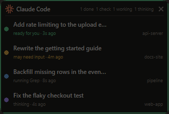

# Claude Monitor

A small always-on-top indicator for Windows that shows, at a glance, which of
your Claude Code conversations are **working** and which are **done and waiting
for you** — so you stop alt-tabbing between terminals to check.

Most of the time it's just this — one dot per session, tucked in the corner,
with a green ring when something wants you:


Hover to expand it into the full list, and click a row to jump straight to that
conversation's window:



## Install

Requires Windows and Python 3.8+ on your PATH. No packages to install —
it uses only `tkinter` and `ctypes` from the standard library.

```bash
git clone https://github.com/Acrobro/claude-monitor.git
cd claude-monitor
powershell -ExecutionPolicy Bypass -File install.ps1 -Startup
```

No Git? Download the ZIP from the repo's green **Code** button, extract it,
then right-click `install.ps1` → **Run with PowerShell**.

That adds a **Claude Monitor** entry to the Start Menu (searchable, and
right-click → pin to Start or taskbar). `-Startup` also launches it with
Windows; drop the flag if you'd rather start it yourself. To uninstall:

```bash
powershell -ExecutionPolicy Bypass -File install.ps1 -Remove
```

You can also just double-click `Claude Monitor.vbs`. Launching twice is
harmless — a second copy detects the first and exits.

## Reading it

| Colour | State | Meaning |
| --- | --- | --- |
| 🟢 green | **ready for you** | the turn ended and you haven't looked yet — the pill grows a green ring and pulses |
| 🟣 violet | **thinking** | the model is generating; no tool running |
| 🔵 blue | **working** | a tool is executing — the row names it ("running Bash") |
| 🟡 amber | **may need input** | blocked on a tool for 3min+ with nothing to suggest it's still busy; possibly a permission prompt |
| ⚫ grey | **done** | finished, and you've already seen it |

Violet and blue both mean busy; the split tells you *why*, which is the
difference between "composing an answer" and "three minutes into a test run".

Green is the only state that nags, and it does so silently — it never makes a
sound or raises a system notification. It clears as soon as you've actually
looked, whether you clicked the row, used *Mark all as seen*, or just
alt-tabbed to that window yourself. Focusing a window counts as reading it, so
the widget never nags about something already on your screen. Sessions that
finished before the monitor started come up grey, so launching it doesn't
drown you in green.

Rows are ordered by most recent activity, so whatever just moved is on top.

## Controls

- **Hover** — expand the list. **Click a row** — raise that conversation's
  window and mark it seen.
- **×** in the panel header — quit.
- **Drag** — move it; the position is remembered.
- **Resize from any edge or corner.** Whichever side you grab, the opposite
  one stays pinned:
  - **left / right edge** — width. Longer titles fill the extra room rather
    than staying cut off.
  - **top / bottom edge** — row height, for roomier rows.
  - **any corner** — both at once, proportionally.

  The only exception is the top-right corner, which belongs to the quit
  button. A grip lights up when you're on it and the cursor changes to show
  which way it'll go; the panel stays open while the pointer is anywhere near
  it, so it won't fold away mid-drag.
- **Ctrl + scroll wheel** — scale the whole thing, 70% to 250%. Also under
  right-click → *Size*, with presets and *Reset size*.
- **Right-click** — keep expanded, include detached background jobs, mark all
  seen, reset position, quit.

Everything is remembered in `~/.claude-monitor.json`, and sizing stacks on top
of your display's DPI scaling rather than replacing it.

## Which sessions show up

Only the ones you actually have open: the process must be alive **and** resolve
to a real window. A CLI session owns no window of its own, so the monitor walks
up the process tree to the terminal hosting it. Detached background jobs
(`kind: "bg"`) have no window anywhere in their ancestry and are left out —
enable *Include detached background jobs* if you want them.

Windows Terminal is a single process hosting every terminal window, so windows
are matched to sessions by title (Claude Code puts the conversation title in
the terminal title). Without that, every session in Windows Terminal would
focus the same window.

That title match is also how "you've already looked at it" works when two
sessions share one terminal: the title tells us which tab is on top. If it
names neither, nothing is cleared rather than guessing wrong.

## How it works

Everything is read-only and local; nothing is sent anywhere. Claude Code keeps
two things on disk that make this possible:

**`~/.claude/sessions/<pid>.json`** — one file per running process, with the
session id, cwd, kind, a friendly name, and (for CLI sessions) a live
`status` of `busy` / `idle` / `shell`. Stale files linger after a process
exits and pids get recycled, so a session counts only if the pid is alive
*and* still a Claude process. An in-place update renames the running binary to
`claude.exe.old.<ts>`, so that check is a prefix match.

**`~/.claude/projects/<slug>/<session-id>.jsonl`** — the transcript. The
monitor reads the last 256KB and walks backwards to the first decisive entry:

| Last entry | State |
| --- | --- |
| `system` with `subtype: "turn_duration"` | done — written the instant a turn ends |
| `assistant` with `stop_reason` other than `tool_use` | done |
| `assistant` containing a `tool_use` block | working, on that tool |
| `assistant` with text or thinking only | thinking |
| `user` — a prompt, or a returning tool result | thinking |

`stop_reason` is what makes this reliable across entrypoints: `turn_duration`
is only written by the CLI, so desktop sessions would otherwise never register
as finished. Where the registry publishes a `status`, it wins — `busy` means
the session really is working however long it has been quiet, which is what
keeps long-running tools from being mistaken for stalled ones.

Ages come from the timestamp inside the last real event, not the file's mtime:
transcripts get rewritten with metadata long after the last actual activity, so
mtime can read as seconds old on a session that has been idle for hours.

One process snapshot and one window enumeration per tick cover liveness,
parentage and window ownership together, and transcript parses are cached on
file mtime — so idling costs a handful of `stat` calls per second.

## Debugging

```bash
python claude_monitor.py --probe
```

Prints what the monitor currently sees, as text, and exits. Add `--all` to
include detached jobs.

## Caveats

- Windows only — it leans on Win32 APIs for window and process discovery.
- Clicking a row raises the *window*, not the individual tab. Two sessions in
  one Windows Terminal window, or the Claude desktop app's own tabs, can't be
  singled out further.
- The amber "may need input" state is a guess, not a signal Claude Code
  publishes. Everything else is read directly.

## License

MIT
